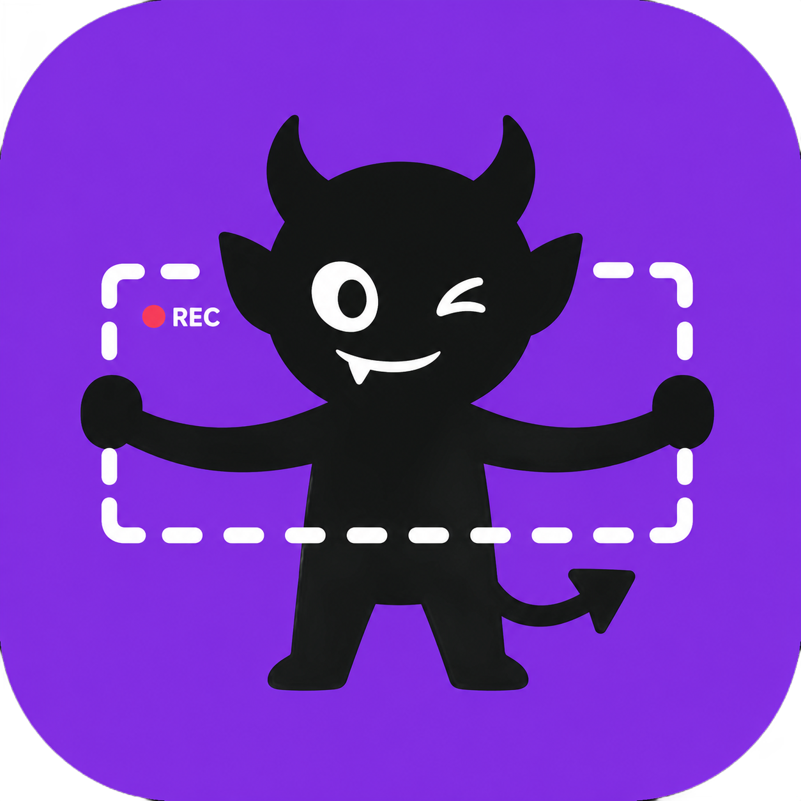

# ImpRec

A lightweight, open-source screen recorder for macOS. Menu bar only, zero config, good compression.



## Features

- **Menu bar only** — lives in the menu bar with negligible idle footprint, no Dock icon
- **One-click recording** — left-click to start/stop, right-click for menu
- **Window or display** — system picker lets you choose what to record
- **Built-in editor** — trim your recording with frame-precise controls before saving
- **Good compression** — records via ScreenCaptureKit (hardware), exports via ffmpeg x264 (small files)
- **Keyboard shortcuts** — Space (play/pause), ←→ (frame step), `,`/`.` (frame step)

## Install

### Download

Grab the latest DMG from [Releases](https://github.com/rxliuli/imp-rec/releases).

### Homebrew (coming soon)

```bash
brew install --cask imp-rec
```

## Requirements

- macOS 14.0 (Sonoma) or later
- Screen recording permission (prompted on first launch)
- [ffmpeg](https://formulae.brew.sh/formula/ffmpeg) (optional) — enables better x264 compression; works without it using built-in AVFoundation

## Build from source

```bash
git clone https://github.com/rxliuli/imp-rec.git
cd imp-rec
xcodebuild -project imp-rec.xcodeproj -scheme imp-rec -configuration Release build
```

## Tech stack

| Layer | Choice |
|-------|--------|
| UI | SwiftUI + AppKit (menu bar) |
| Capture | ScreenCaptureKit |
| Record | AVAssetWriter (H.264) |
| Export | ffmpeg libx264 |
| Output | MP4 (H.264) |

## License

[GPL-3.0](LICENSE)
